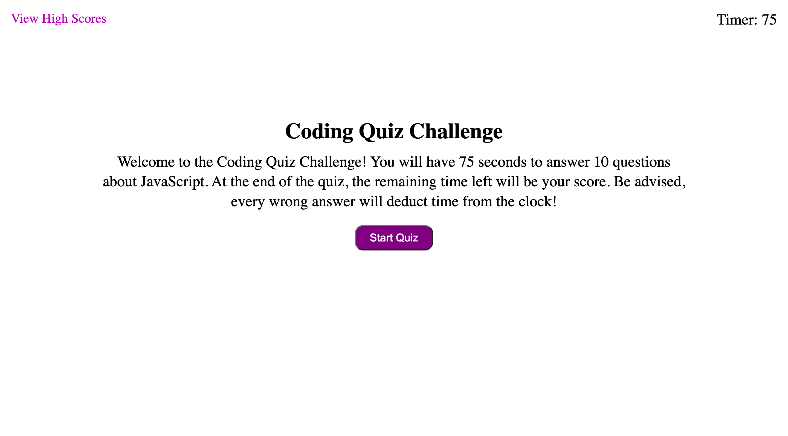

# JavaScript Code Quiz

## Deployed Site

[JavaScript Quiz](https://cmskorcz.github.io/javascript-code-quiz/)

## Description
A JavaScript coding quiz consisting of 10 multiple-choice questions. A user has 75 seconds to answer these questions. If an answer is correct, the user continues on to the next question. If answered incorrectly, 10 seconds is taken off of the user's time, and the user will continue on to the next question.

The quiz is completed once all 10 questions are answered, or if the time reaches 0. At the end of the quiz, the player's remaining time will be their score, which will be saved and printed out onto a new page. The player will also be able to input their initials to be paired with their displayed score. Scores and initials will be saved to localstorage, and persist after refresh of page.